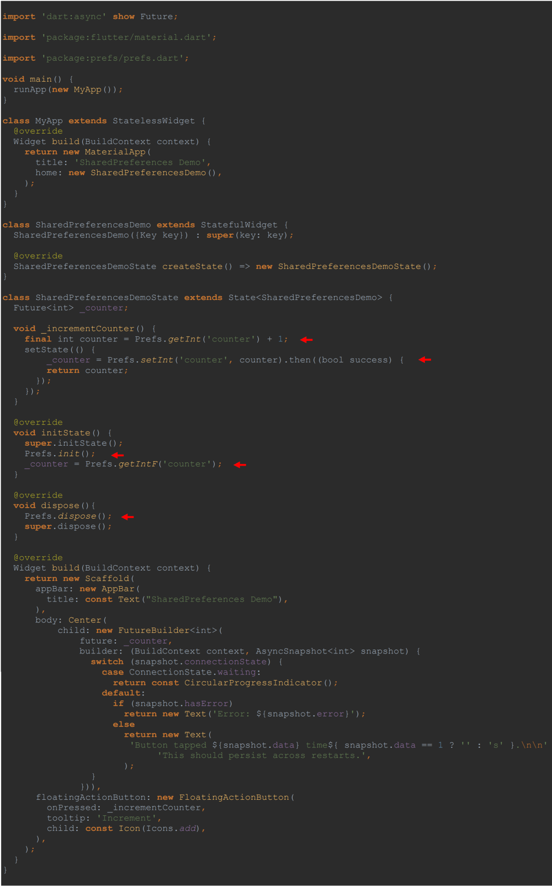
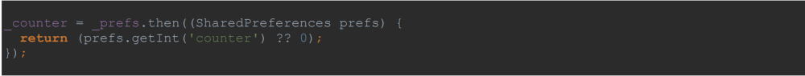
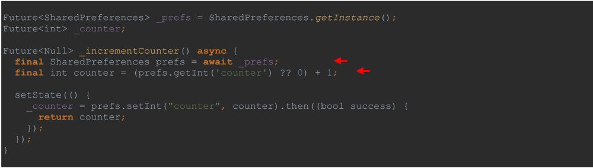
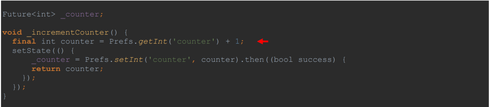
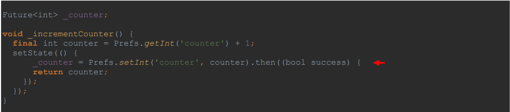
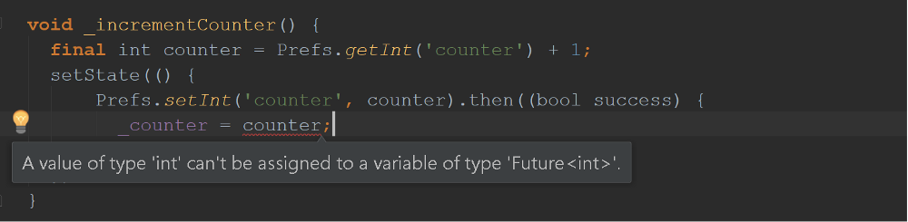
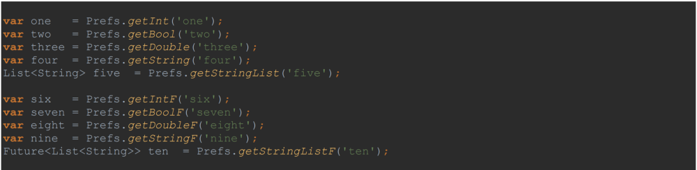
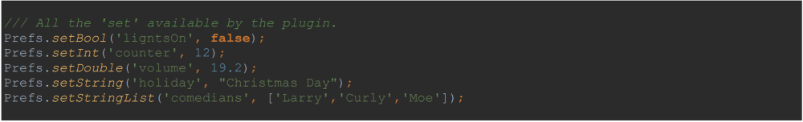

# Store and Read Your App’s Preferences
###### A Flutter Example

## What’s Your Preference?
The plugin, shared_preferences, is offered to Flutter developers to store and read their app’s 
preferences in both the Android and the iOS platform. It wraps the NSUserDefaults (on iOS) and 
the SharedPreferences (on Android), providing persistent storage. Note, as of this writing, 
the plugin does not guarantee its writes to disk and suggests it not be used for storing 
critical data. As it is, it’s worked for me so far. So much so, I’ve adapted it fully for my apps.

## There’s a Class for That
There’s an example provided by the plugin website demonstrating how the plugin is implemented. 
In my opinion, not the most realistic example as it just promptly displays an integer demonstrating
 the success of its persistent storage. Regardless, I will use this same example now in this 
 article to further demonstrate the use of a class library called, prefs.dart, that I freely 
 offer to other developers to quickly and easily implement stored preferences in their app’s. 
 Here you go, copy the last three lines listed below and place them in your own pubspec.yaml file.
  You’re then on your way to storing preferences in your Flutter app.
  
  
  
Better still, download the file, perfs.dart, as there’s no guarantee that repo.
, perfs.git, will last forever.

This Dart library is under the APACHE license. It’s free! Take it, make it better and then share.

## Take Five
Below is the main.dart file that is very much like the example found in the plugin website. 
However, this file instead uses the class library, prefs.dart, to do much of the ‘heavy lifting’
behind the scenes when it comes to using the plugin. As a result, there are five lines 
in all required to implement and to demonstrate the app’s preferences storage and 
retrieval capabilities.
 
 

## What’s Going On Here
After looking over the code above, there are a few things you will have noticed regarding
 the implementation of the class library. It’s all static function calls for one. 
 Nothing is instantiated. You’d guess right, if you then deduced this is a static class. 
 You won’t find any instance variables or instance methods in this class library. 
 This allows you to more easily implement your app’s preferences anywhere in your app.
  Preferences are an important concern for your app, and so you should be able to reference
   them any time and any where in your app.
   
The only real requirements is that you first initialize the class library in 
the State object’s initState() function, and that you then clean up things 
in the State object’s dispose() function. After that, you are then free to 
call up preferences any time; any where they’re needed in your app.

Therefore, in this example, you see a call to static class function, 
Prefs.init(), to initialize, as it happens, a reference to the plugin, 
shared_preferences, in the State object’s initState() function. 
Correspondingly, you see a call to static class function, Prefs.dispose(), 
in the State object’s dispose() function to then clean things up when the 
app is terminated. Pretty straight forward. You don’t need to be concerned 
with what goes on this those functions — of course, being a free class library,
 you can readily go take a peek.
 
## The Future is Now…or Not
Like the original example in the plugin’s website, 
this example uses a Future object of type Future<int> in a ‘library-private’
 variable called, _counter. Like the original example, this ‘counter’ is 
 assigned a value in the State object’s initState() function. 
 However, you’ll find that, in the original, the code is a little more verbose:
 
 
 
In our example, the code does the very same thing, but it’s little cleaner:

  

It too returns a ‘Future’ object of type integer — a value of zero if the ‘counter’
key returns null. Returning null means there is no preference value with that
key as of yet. Above, in the original code, you can determine a Future object
is involved seeing that the callback function, then(), is being utilized. 
In our code, it’s the capital ‘F’ appended on the end of the function’s name 
that gives us the hint. Lastly, like the original code, the function, 
getIntF(), returns a non-null value of zero using the operator, ??, 
but you don’t readily need to know that. 
There’s more encapsulation involved here — keeping some of the operations 
behind the scenes.

In the original example, it takes two lines of code to increment the counter.
A Future object of type integer can not be incremented like a numeric, 
and so we have ‘to wait’ for a ‘SharedPreferences’ object to be instantiated, 
then retrieve a value if any by the key, ‘counter’, and then increment the value by one: 
   
     
   
In our example, we’ve got it down to one short line of code:

 

Retrieving integer values from your app’s preferences is going to be a common operation.
Best to write a function that repeatedly takes care of the details and, 
like the original code, supplies a value of zero if the provided key returns a null.
You see the function doesn’t return a Future object but an integer.
You can readily tell that by the declaration of the variable, counter,
 as well as by the missing capital ‘F.’
 
## The State of the Counter
Further on in the original example, the setState() function is called
 to ‘update’ the counter on the app’s screen:    
 
  
 
In our example, you see the code does the very same thing, but this code doesn’t 
require the parent function, _incrementCounter(), to use the async keyword. 
There’s no await command being used. Nor does it reveal that it’s 
‘SharedPerferences’ that’s the means for the persistent storage. 
Instead, you’re allowed to call this function any time; any where. 
Much cleaner and much easier to use.

  

As an aside, note the use of the ‘return’ statement allows you to assign, in this case,
 an integer value to the Future object, _counter. 
 As you see, you can’t assign the integer value directly to a variable,
  _counter, of type Future<int>. 
  
    
  
## You Get Ten
You can see below all the ‘get’ functions available to the developer when using this class
 library. The first five returns the data type implied in each of the function’s names, 
 while each then has their ‘Future’ counterpart in the remaining five functions.  
 
 
 
## Here’s the Keys
You’ve access to all the keys that can be found in your preferences.
Like the ‘get’ functions, you have the option to return a ‘Future’ type 
of the set of Strings as well. 

 

## Let’s Get Dynamic
If you like, you don’t have to be concerned with the ‘data type’ of the preference 
value and simply call the ‘get’ functions. Again, a ‘Future’ version is available.

 

## It’s All Set Up
Along with the first five ‘get’ functions there is a corresponding ‘set’ function.
Each writes a particular data type to persistent storage. 
With a successful write, a ‘Future’ data type of Boolean is returned, Future<bool>.

 

## Remove and Clear
You have a means to remove a specific preference and or clear out all the 
preferences with one command. They too return the type, Future<bool>.

 

## Conclusion
There you have it. Take this class library, and use it for your app’s preferences.
Better still. Take it, make it better, and then share.
In a future article, as I usually do, I will walk through the class library and 
explain how I implemented this class, and why I did it the way I did it. 
Regardless, this effort is my little way of contributing the fledgling 
Flutter community.